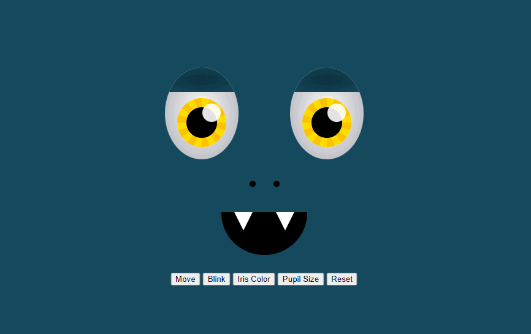

# Eye Exercise 👀

## Description

In this project, the eyes follow the mouse pointer.  Clicking the **Move** button will toggle eyes movement and clicking **Reset** will re-center eyes position.  Clicking the **Blink** button will close and open the eyelids.  Clicking the **Iris Color** button will change the iris color to either yellow, red, purple, blue or green.  Clicking the **Pupil Size** button will decrease or increase the size of the pupils.

## Preview

\* *Demonstration illustrates transitions for the eyes*

## How to Run

1. Fork a copy of this project to your [GitHub](https://github.com) repository
2. Clone a copy from your [GitHub](https://github.com) repository to your local machine
3. Open the index file in your web browser

## Roadmap of Future Improvements

- [x] Add eyelids
- [x] Add iris color change
- [x] Add pupil size change
- [x] Add nose
- [x] Add teeth
- [x] Add eyes position reset button
- [x] Add eyes movement toggle button

## Tech Stack

| Front End    |
| ------------ |
| JavaScript   |

## License Information

[MIT License](https://choosealicense.com/licenses/mit/)

Copyright (c) 2021 [bryanjob](https://github.com/bryanjob)

Permission is hereby granted, free of charge, to any person obtaining a copy
of this software and associated documentation files (the "Software"), to deal
in the Software without restriction, including without limitation the rights
to use, copy, modify, merge, publish, distribute, sublicense, and/or sell
copies of the Software, and to permit persons to whom the Software is
furnished to do so, subject to the following conditions:

The above copyright notice and this permission notice shall be included in all
copies or substantial portions of the Software.

THE SOFTWARE IS PROVIDED "AS IS", WITHOUT WARRANTY OF ANY KIND, EXPRESS OR
IMPLIED, INCLUDING BUT NOT LIMITED TO THE WARRANTIES OF MERCHANTABILITY,
FITNESS FOR A PARTICULAR PURPOSE AND NONINFRINGEMENT. IN NO EVENT SHALL THE
AUTHORS OR COPYRIGHT HOLDERS BE LIABLE FOR ANY CLAIM, DAMAGES OR OTHER
LIABILITY, WHETHER IN AN ACTION OF CONTRACT, TORT OR OTHERWISE, ARISING FROM,
OUT OF OR IN CONNECTION WITH THE SOFTWARE OR THE USE OR OTHER DEALINGS IN THE
SOFTWARE.